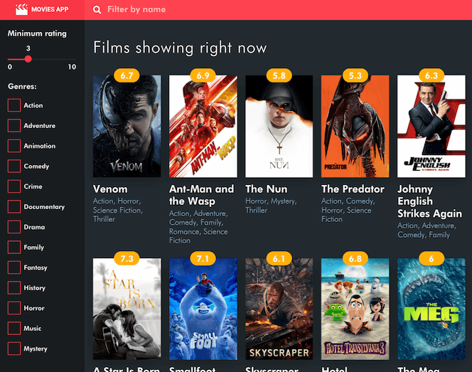
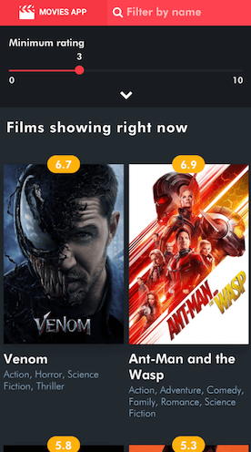

# Movie App
------------------

Desktop                          |    Mobile
:-------------------------:|:-------------------------:
   |   

 
I have chosen to build the app using React, starting with the create-react-app toolkit and I've opted not to use Redux for state management, instead relying on the built-in state management. Adding Redux to a project of this size would, I feel, add unnecessary complexity since the state is not very dynamic and the component tree not very deep.

Feature-wise, I've implemented both the genre & rating filters and also a name filter for easier searching.

I've opted to implement all the component from scratch for this challenge, including the checkbox component and the range slider. (Both because I thought that would give a better insight into my ability and also because I don't think there are any suitable standalone components out there)

Testing is done with jest and react-test-renderer for unit testing. In a production application I would have added more unit tests and also E2E testing, but for the purposes of this challenge, I think that unit testing coverage is enough.
 
 The app can be run by running the webpack dev server:
 
 `$ npm run start` 
 
 
 The end-result is also published on Github Pages and can be found [here](https://dragosiordachioaia.github.io/movie-app/)
 

