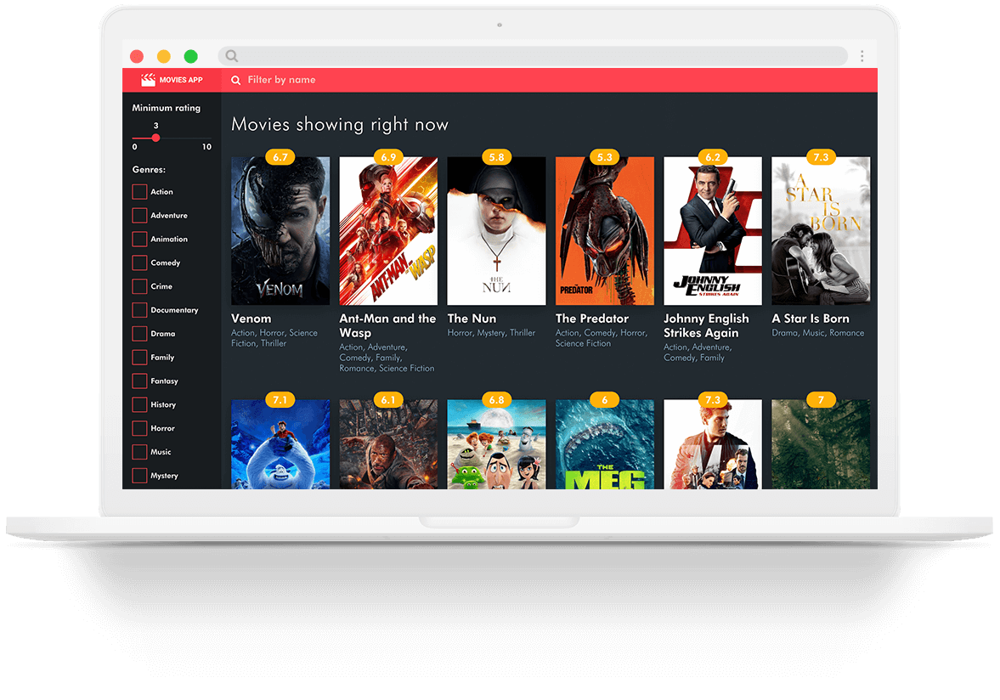
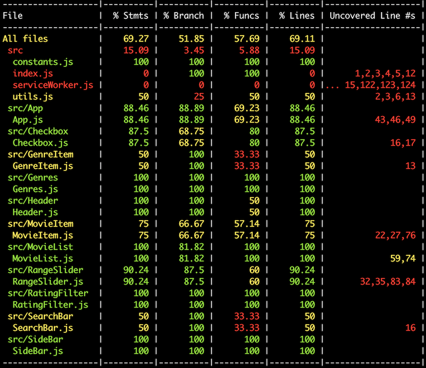

## Overview
 
The app shows a list of the movies currently running in cinemas, with information taken from the tMDB API.

The design attempts to recreate a little of the cinema experience: the theme is dark and muted, with colourful accents and clean but bold typography.

Feature-wise, I've implemented both genre & rating filters, but also a name filter for easier searching.

## Notes on implementation

I have chosen to build the app using React, starting with the create-react-app starter kit and without Redux. I think that adding Redux to a project of this size would add unnecessary complexity, since the state is not very dynamic and the component tree not very deep.

I've opted to implement all the components from scratch, including the checkbox component and the range slider. (Both because I thought that would give a better insight into my ability and also because I don't think there are any suitable standalone components out there).

Styling is done via SASS, with each component having its own (external) stylesheet.

## Running the app

The app can be run by running the webpack dev server:
 
`$ npm run start` 
 
## Testing
 
The end-result is also published on Github Pages and can be found [here](https://dragosiordachioaia.github.io/movie-app/)

Testing is done with jest and `react-test-renderer` for unit testing. In a production application I would have added more unit tests and also E2E testing, but for the purposes of this challenge, I think that unit testing coverage is enough.

 
 
 

